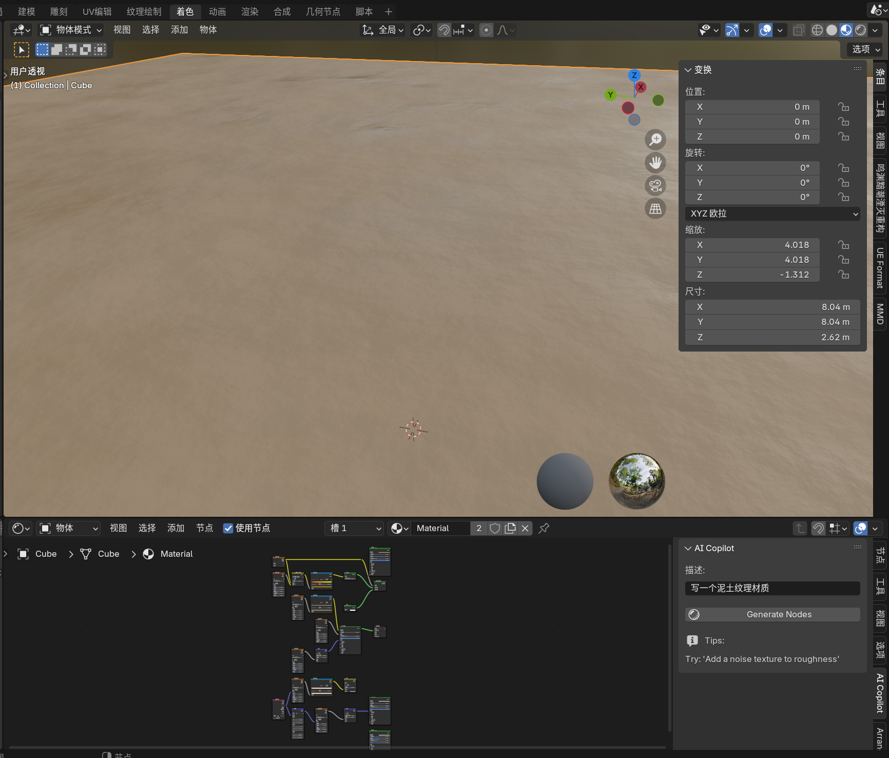
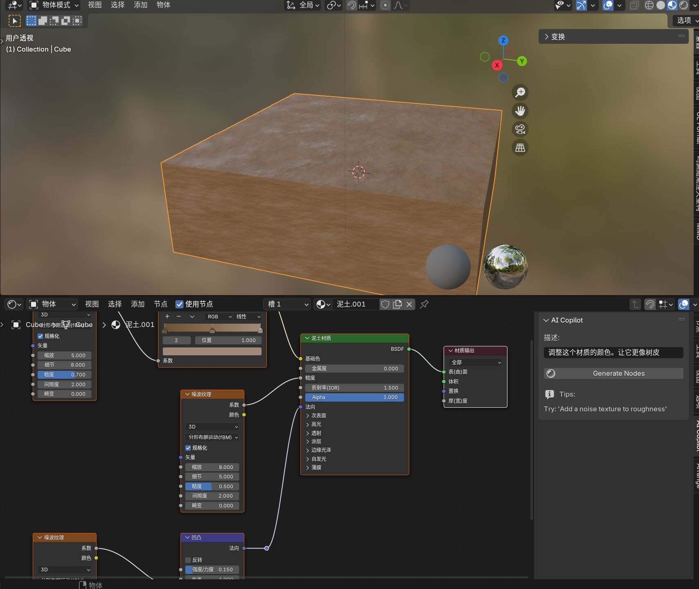
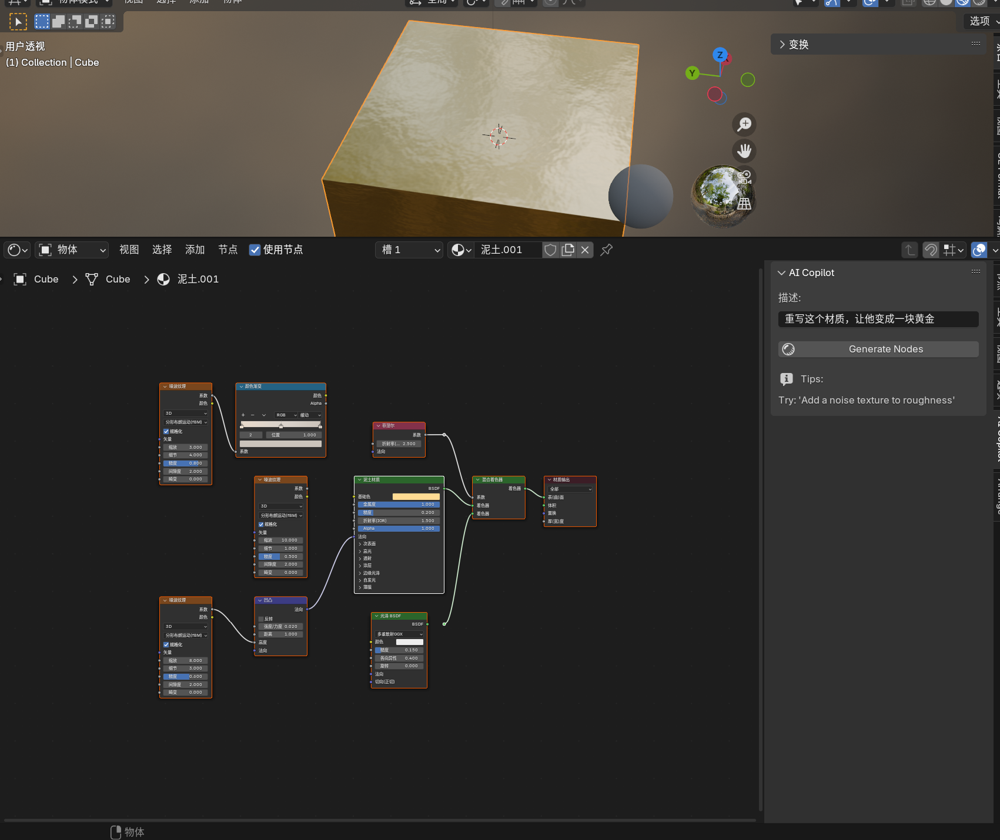
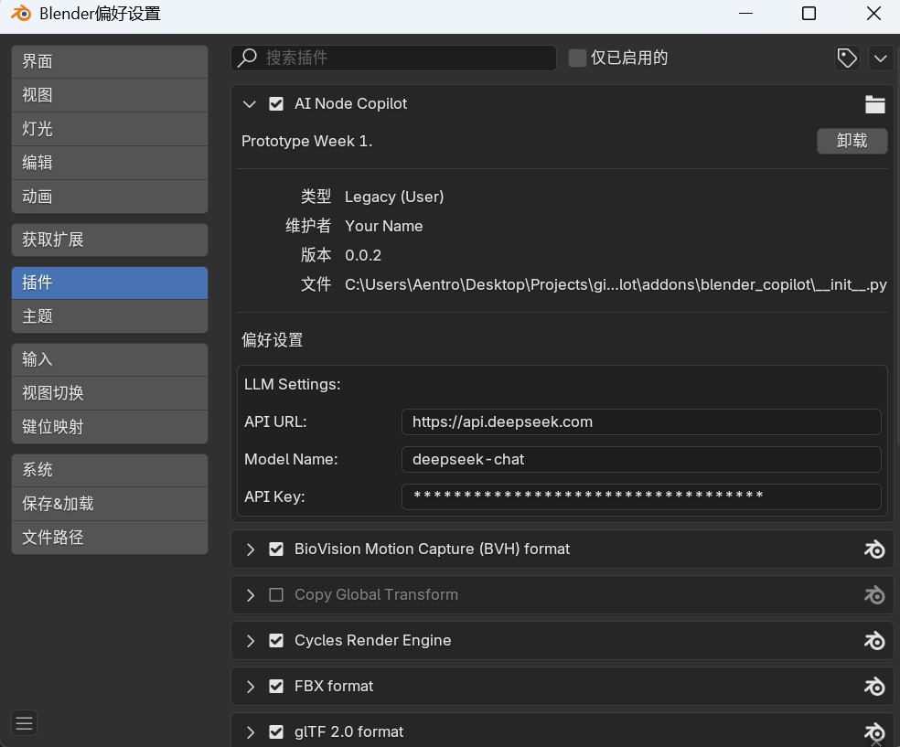

# Blender Copilot

**让 LLM 帮你写蓝图！**
Blender Copilot 是一个基于大语言模型（LLM）的 Blender 插件，允许用户通过自然语言生成和修改 Shader（着色器）节点蓝图。

https://github.com/user-attachments/assets/8a3fbff1-ee19-4a87-a3c0-83d6744830aa

> ⚠️ **注意 / Note**

> 目前本项目处于 **实验阶段 (Experimental)**。
> 建议 Blender **4.2** 版本。

## ✨ 功能特性 (Features)

- **文本生成节点**: 输入 "创建一个生锈的黄金材质"，自动生成节点网络。
- **上下文感知修改**: 支持基于现有节点进行修改（例如："把刚才的纹理改得更粗糙一点"）。
- **多模型支持**: 兼容 OpenAI 格式接口，支持 **DeepSeek** (推荐)、OpenAI、Kimi、本地 Ollama 等模型。

## 📸 效果展示 (Gallery)

### 一键生成材质

### 基于现有节点修改
通过读取当前节点树的上下文，AI 可以理解并修改现有的连接。

## 🛠️ 安装与配置 (Installation)

1. **下载**: 在 Releases 页面下载最新的 `.zip` 压缩包。
2. **安装**: 打开 Blender -> `Edit` -> `Preferences` -> `Add-ons` -> `Install...`，选择压缩包安装。
3. **配置**: 
   - 在插件设置面板中，填入你的 LLM 配置。
   - **配置示例 (DeepSeek)**:
     - API URL: `https://api.deepseek.com/chat/completions`
     - Model: `deepseek-chat`
     - API Key: `sk-xxxx`

## 🚀 使用方法 (Usage)

1. 打开 **着色器编辑器 (Shader Editor)**。
2. 按 `N` 键打开侧边栏，找到 **AI Copilot** 标签页。
3. 在输入框中描述你想要的材质效果。
4. 点击 **Generate**。

## 💡 最佳实践与建议 (Tips)

* **辅助插件**: 建议搭配 **Node Arrange** 插件使用。用于自动排版LLM生成出的节点。

## 📄 License

MIT License
