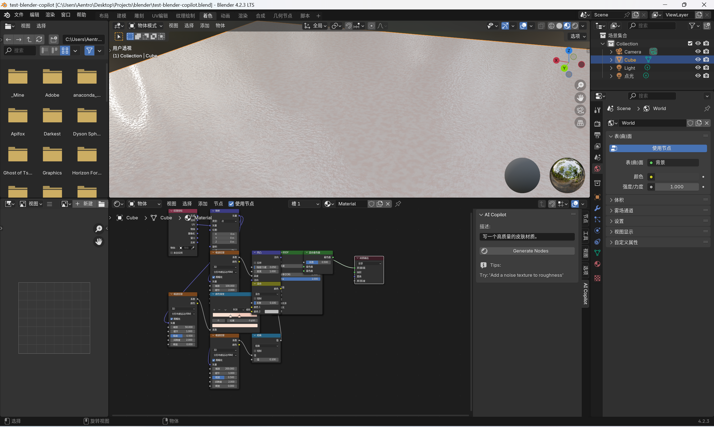

# blender_copilot
让LLM帮你写蓝图！

## 目前处于实验阶段，只支持着色器蓝图。
类似这样，一键生成材质节点。

同时也支持对于当前着色器节点进行修改

不过说实话并不好用，现在还只是个玩具

## 使用
安装插件，在插件设置中配置LLM的apikay后，在着色器编辑器右侧的面板输入提示词即可。

同时建议搭配 node arrange 插件在生成后自动排布节点。

此外，插件基于blender4.2开发，不同的版本可能造成调用接口的差异，导致无法正常生成节点。