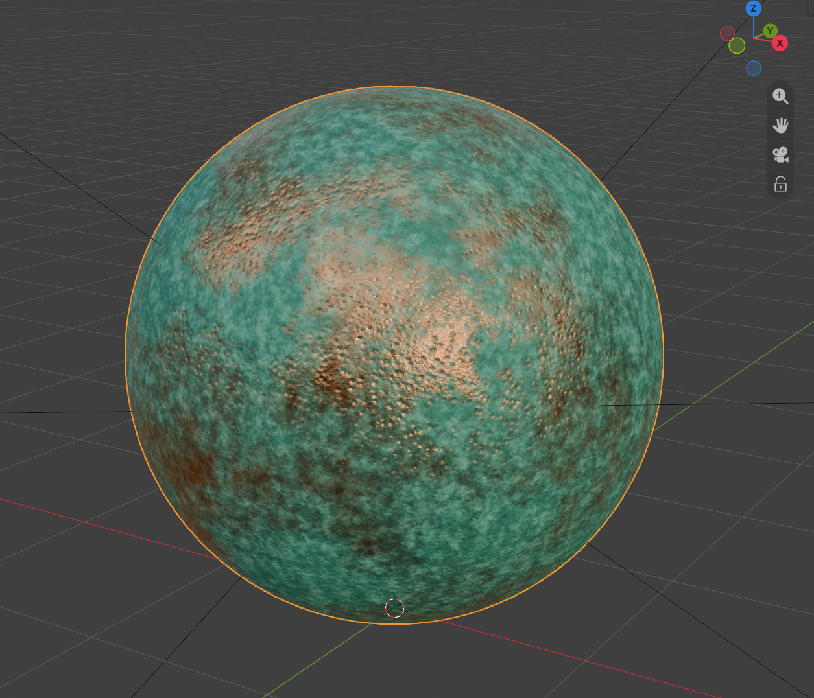
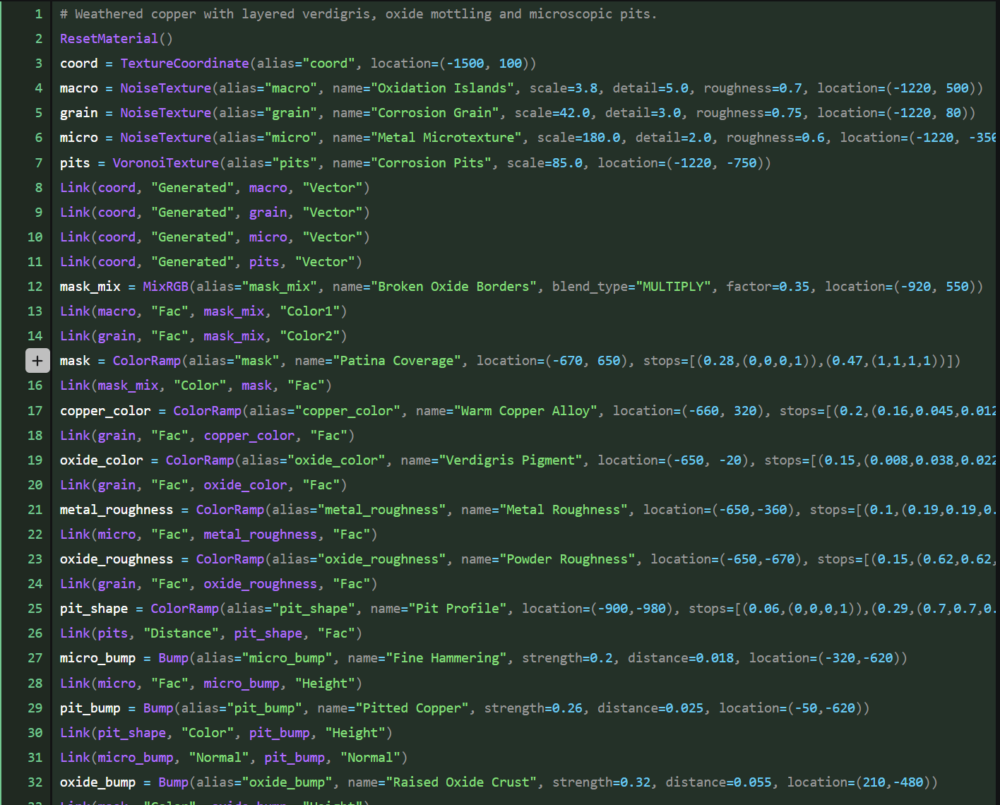
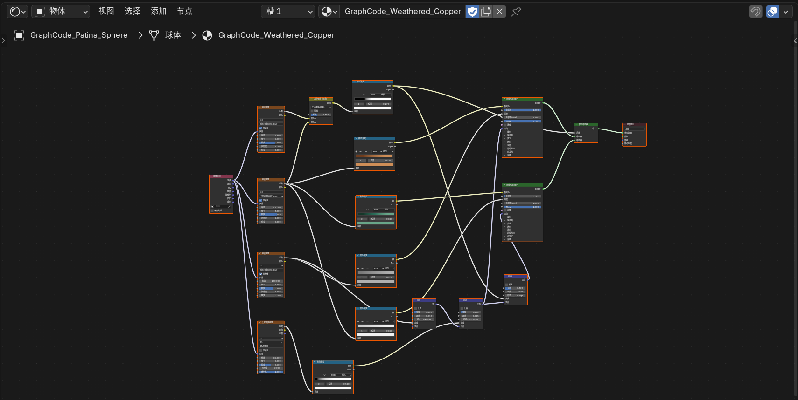

# Blender Copilot

**让你的 AI agent 通过 Graph Code 创建和编辑 Blender 材质。**

在 Codex 等支持 MCP 的 agent 中描述材质需求，Blender Copilot 将可编辑的 Graph Code 转换成 Shader 节点。你也可以读取已有材质，继续调整颜色、纹理、参数与连接。



上图示例使用 19 个节点、27 条连接，组合金属露底、青绿色氧化层、粗糙度变化和多层凹凸。查看 [完整 Graph Code](examples/weathered_copper.py)。

## 从代码到材质

Graph Code 是 Python 风格的材质描述语言。Agent 负责理解需求和编写代码，插件负责读取节点图、校验代码并将修改应用到 Blender。



同一份代码在 Blender 中生成可继续编辑的 Shader 节点图：



- **创建材质**：从自然语言需求生成程序化材质。
- **修改已有图**：读取当前节点与参数，保留已有节点继续编辑。
- **应用前校验**：在临时材质副本上检查节点、socket 和参数。
- **保留源码**：Graph Code 保存为文本文件，便于编辑与版本管理。
- **插件直接接入 agent**：内置 HTTP MCP，无需额外安装 Python 或运行独立服务。

## 快速开始

需要 **Blender 5.2.x** 和支持 **MCP Streamable HTTP** 的本地 agent。当前验证平台为 Windows；其他平台尚未完成验证。

### 1. 下载并安装

从 [Releases](https://github.com/entropy622/blender_copilot/releases) 下载 `blender_copilot-<version>.zip`。

在 Blender 中打开 **Edit → Preferences → Add-ons → Install from Disk**，选择 ZIP 并启用 **Blender Copilot — Graph Code Tools**。

启用插件后，MCP 服务自动运行；禁用插件或关闭 Blender 后停止。升级旧版时建议安装后重启 Blender。

### 2. 配置 agent

在插件偏好设置中点击 **Copy Codex Config** 或 **Copy MCP JSON**，将复制的配置加入 agent 的 MCP 设置。

Codex 配置形式如下，实际地址与 token 以插件复制的内容为准：

```toml
[mcp_servers.blender_graph]
url = "http://127.0.0.1:9877/mcp"
http_headers = { Authorization = "Bearer <插件生成的 token>" }
tool_timeout_sec = 45
```

重新加载 agent 的 MCP 配置，调用 `blender_status` 确认连接。Blender 与 agent 应运行在同一台电脑；远程云端 agent 无法直接访问此本地地址。

### 3. 描述材质

> 查看当前材质，为它生成风化铜效果，带青绿色铜锈、金属露底和细小蚀坑。先校验 Graph Code，再应用并读取结果。

> 保留当前节点组，把表面粗糙度调到 0.55，让铜锈颜色更深一些。

Blender 内无需填写模型名称或 API Key，对话与模型配置由你选择的 agent 管理。

## Graph Code 示例

```python
ResetMaterial()
output = OutputMaterial()
surface = PrincipledBSDF(
    base_color=(0.65, 0.27, 0.10, 1.0),
    metallic=0.95,
    roughness=0.32,
)
Link(surface, "BSDF", output, "Surface")
```

修改已有节点：

```python
surface = Existing("Principled BSDF")
SetInput(surface, "Roughness", 0.55)
```

Graph Code 是受限 DSL，不执行任意 Python。完整语法见 [Graph Code 文档](doc/material-graph-code.md)。

## 可用工具

| 工具 | 用途 |
| --- | --- |
| `blender_status` | 查看 Blender 状态和支持的 Graph Code 函数 |
| `list_materials` | 列出材质与对象绑定 |
| `get_material_graph` | 读取实时图、Graph Code、已保存源码和 revision |
| `get_node_schema` | 查询节点 socket、属性和枚举 |
| `validate_graph_code` | 在临时副本上检查代码 |
| `apply_graph_code` | 检查 revision，校验并应用代码 |
| `create_material` | 创建材质，可追加到指定对象的材质槽 |

推荐流程：**读取 → 编写 → 校验 → 应用 → 回读确认**。

## 使用说明

- 实时图导出使用 `Existing(...)`，适合继续编辑同一材质。它依赖现有节点，并不打包节点组内部、外部图像、动画或驱动。
- 需要从空材质重建时，应保留完整构造代码；对已有材质执行 `ResetMaterial()` 需要 `allow_reset=true`。
- 默认源码存于 `.blend` 同目录的 `blender_copilot_graphs/`，未保存场景时使用用户目录。可在插件设置中修改。
- 工具不会自动保存 `.blend`。创建材质时追加材质槽，已有面的材质分配由 Blender 管理。
- 服务仅监听本机回环地址，使用本地 token 验证访问。不要将含 token 的个人配置提交到公开仓库。

## 文档

- [连接、升级与排错](doc/connection.md)
- [Graph Code 语法与转换边界](doc/material-graph-code.md)
- [开发、测试与打包](doc/development.md)
- [旧版 README](README.legacy.md)

Graph Code 思路参考 [Ayaya_Miliastra_Editor](https://github.com/AyayaXiaowang/Ayaya_Miliastra_Editor)。

[MIT License](LICENSE)
