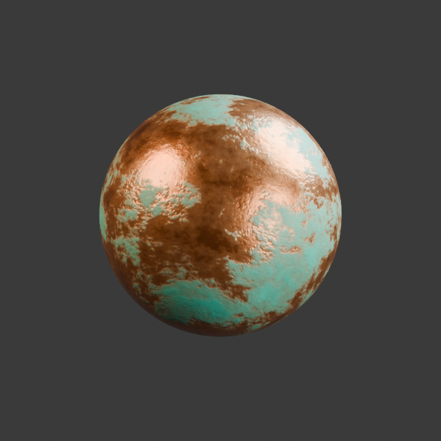
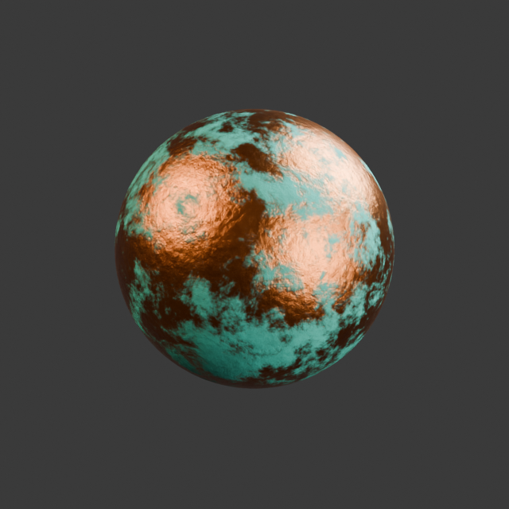

# 风化铜材质：Blender MCP 与 Graph Code 对比

2026-09-10 · Blender 5.2.1 LTS · Blender Copilot v0.4.0

两名独立上下文的 GPT-5.6-sol 子代理均使用中等思考，分别通过通用 Blender MCP 编写 `bpy`，以及通过 Blender Copilot MCP 编写 Graph Code，完成同一材质目标。

## 测试方式

目标是制作程序化风化铜：温暖的裸露铜面、不规则青绿色铜锈、斑驳过渡、粗糙度变化和细小蚀坑，不使用图片贴图。

两组使用相同的 MCP SDK 客户端，依次连接各自后端。**时间与 token 统一统计从子代理启动到首次成功应用材质**，包含工具发现、节点查询、代码编写及应用前校验。

## 结果

| 指标 | 通用 Blender MCP / bpy | Blender Copilot / Graph Code |
| --- | ---: | ---: |
| 成功应用材质耗时 | 168.6 秒 | 218.6 秒 |
| 未缓存输入 token | 6,734 | 23,854 |
| 缓存输入 token | 83,072 | 228,352 |
| 输出 token（含推理） | 4,708 | 5,604 |
| 累计 token（含缓存输入） | 94,514 | 257,810 |
| 材质相关 MCP 调用次数 | 1 | 16 |
| 最终节点数 | 19 | 17 |
| 最终连线数 | 25 | 23 |
| 材质实现代码字符数 | 7,192 | 3,936 |

MCP 调用次数不含工具列表查询。累计 token 包含多轮重复输入的上下文，不代表单次上下文长度，也不能直接当作费用。

## 渲染效果

两组均通过节点连接与材质绑定检查，并使用相同设置完成独立渲染：Cycles CPU、640 × 640、32 samples、固定随机种子、开启降噪。

| 通用 Blender MCP | Blender Copilot |
| --- | --- |
|  |  |

通用 MCP 版本铜面更明亮、铜锈偏浅青色；Graph Code 版本的青绿斑驳和微表面起伏更明显。两者均呈现目标特征，具体视觉风格与节点结构有所不同。

## 观察

本次 Graph Code 的实现代码短约 **45%**，但材质生成耗时与 token 用量更高。插件组进行了 **11 次节点 schema 查询**，增加了交互轮次；通用 MCP 则将节点构建集中在一次 Python 执行中。精简 DSL 说明、批量查询或缓存节点 schema，是后续值得验证的优化方向。

